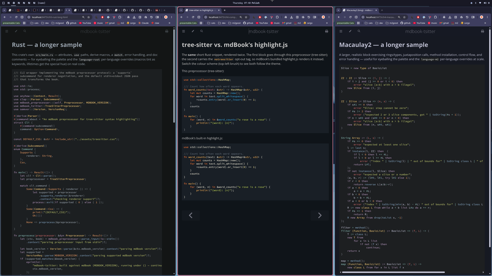

# mdbook-tsitter

> tree-sitter syntax highlighting for [mdBook](https://rust-lang.github.io/mdBook/) — for any language you can point a grammar at.

<p align="center">
  
</p>

mdBook's built-in highlighter (highlight.js) classifies tokens with regular
expressions and a fixed, generic set of classes. `mdbook-tsitter` replaces it
with [tree-sitter](https://tree-sitter.github.io/): your code is actually
*parsed*, so highlighting is structural and precise, works for any language with
a grammar, and is fully themeable from CSS.

It is grammar-agnostic — it ships no grammar of its own. You point it at a
compiled parser and a highlights query, and it highlights that language.

## What you get

- **Real parsing, not guessing.** tree-sitter builds a syntax tree, so a
  function *definition*, a *call*, a macro, a type, and a variable each get
  their own highlight — the way your editor shows them.
- **Any language.** Anything with a tree-sitter grammar, including languages
  mdBook's default highlighter handles poorly or not at all.
- **Embedded languages.** Fenced code inside Markdown, a sub-language inside a
  string, and the like are highlighted with their own grammar via injection
  queries.
- **Editor-grade theming.** Every capture becomes a `ts-…` CSS class, so you can
  recolour anything from a stylesheet — at the granularity the grammar defines,
  not a dozen generic buckets.
- **Per-block opt-out.** Keep mdBook's Rust Playground "Run" button, hidden
  lines, and `no_run` widgets on the blocks that need them.
- **Build-time, no client JS.** Blocks ship pre-highlighted; nothing runs in the
  reader's browser.

## Why swap the highlighter?

mdBook's default, highlight.js, has no real grammar — it matches tokens with
regexes and exposes a fixed set of generic classes. It can't tell a function
definition from a call, a type from a variable, or a macro from a function, and
many languages it simply doesn't cover.

tree-sitter parses the source into a concrete syntax tree and tags each node
with a capture from the grammar's own query:

|                          | highlight.js (default)         | mdbook-tsitter                    |
| ------------------------ | ------------------------------ | --------------------------------- |
| Method                   | regex / heuristic              | real parse tree                   |
| Token granularity        | fixed, generic classes         | every capture the grammar defines |
| def vs call, type vs var | no                             | yes                               |
| Language support         | its bundled grammars           | any tree-sitter grammar           |
| Embedded code            | no                             | via injection queries             |
| Theming                  | fixed class set                | one CSS class per capture         |

## Using it

Enable the preprocessor and configure a language in `book.toml`:

```toml
[preprocessor.tsitter]

[preprocessor.tsitter.languages.rust]
library = "parsers/rust.so"            # compiled parser, relative to the book root
highlights = "queries/rust/highlights.scm"
```

Now every ```` ```rust ```` block is highlighted by tree-sitter. Blocks in
languages you haven't configured (or with no language tag) are left to mdBook
untouched, so its default highlighter still handles them.

### Configuration reference

Everything lives under `[preprocessor.tsitter]`. Paths are relative to the book
root.

Top-level:

| key      | default | meaning                                                                                                                                                                                                                                                              |
| -------- | ------- | ---------------------------------------------------------------------------------------------------------------------------------------------------------------------------------------------------------------------------------------------------------------------- |
| `inject` | `true`  | Highlight languages embedded in a block via a grammar's injections query. Only configured languages are ever used; injection never loads a new grammar. Set `false` to switch it off (and skip loading `injections.scm`, so a broken injections query can't break highlighting). |

Per language, under `[preprocessor.tsitter.languages.<name>]`:

| key          | required | meaning                                                                       |
| ------------ | -------- | ----------------------------------------------------------------------------- |
| `library`    | yes      | Path to the compiled parser shared object (`.so` / `.dylib` / `.dll`).        |
| `highlights` | yes      | Path to the highlights query (`highlights.scm`).                              |
| `symbol`     | no       | Parser constructor symbol; defaults to `tree_sitter_<name>` (`-` → `_`).      |
| `injections` | no       | Path to an injections query, for embedded languages.                          |
| `locals`     | no       | Path to a locals query, for scope-aware highlighting.                         |
| `aliases`    | no       | Code-fence tags this grammar handles; defaults to the table key.              |

### Leaving a block to mdBook

Replacing a block's HTML means mdBook's own per-block machinery — highlight.js,
and for Rust the Playground "Run" button, runnable tests, hidden `#` lines, and
`ignore`/`no_run` annotations — no longer applies to that block (both want to
own its HTML). Add the `notreesitter` tag to a fence to leave that single block
to mdBook with all its widgets intact:

````markdown
```rust,notreesitter
# fn main() {
let runnable = "mdBook still adds the Run button and hides this line";
# }
```
````

## Theming — editing the colours

Write the default stylesheet into your book and reference it:

```sh
mdbook-tsitter css > theme/treesitter.css
```

```toml
[output.html]
additional-css = ["theme/treesitter.css"]
```

The default theme adapts to mdBook's built-in colour schemes (light, coal, navy,
ayu); edit `theme/treesitter.css` to recolour anything.

Each tree-sitter capture becomes a class with the `ts-` prefix and dots turned
into hyphens, and every prefix is emitted so broad rules cascade and specific
ones override:

| capture            | classes                          |
| ------------------ | -------------------------------- |
| `keyword`          | `ts-keyword`                     |
| `keyword.operator` | `ts-keyword ts-keyword-operator` |
| `string.regexp`    | `ts-string ts-string-regexp`     |

There is no fixed list of supported captures — the preprocessor reads the
capture names out of each grammar's own query, so it supports whatever that
query defines (captures whose name starts with `_` are treated as internal and
left unstyled). The default stylesheet covers the
[standard tree-sitter / nvim-treesitter capture names](https://github.com/nvim-treesitter/nvim-treesitter/blob/main/CONTRIBUTING.md#highlights)
(`@comment`, `@keyword`, `@string`, `@function`, `@type`, `@variable`, …), so a
grammar whose query uses those names is styled out of the box. Add rules for any
extra captures your grammar defines.

## How it works

A preprocessor receives each chapter as Markdown and returns modified Markdown.
This one parses the Markdown with the same parser mdBook uses
([pulldown-cmark](https://docs.rs/pulldown-cmark)), finds every fenced code
block whose info string names a configured grammar, highlights its contents at
build time, and splices in a ready-made HTML block:

```html
<pre class="treesitter"><code class="no-highlight language-rust">…spans…</code></pre>
```

The `no-highlight` class stops mdBook's default highlight.js from re-processing
the spans; the language class is preserved for theming hooks. All grammars in a
run share one capture-class table, so a span produced by an injected
sub-language resolves to the same colours as the host language.

## Requirements & install

```sh
cargo install mdbook-tsitter
```

The `mdbook-tsitter` binary must be on your `PATH`. You also need, per language,
a compiled parser and its queries (below).

### Getting a parser and queries

Most grammars live in a `tree-sitter-<lang>` repository. With the
[tree-sitter CLI](https://github.com/tree-sitter/tree-sitter):

```sh
git clone https://github.com/<owner>/tree-sitter-nix
cd tree-sitter-nix
tree-sitter build --output libtree-sitter-nix.so
```

On Windows that build produces a `.dll` (and a `.dylib` on macOS); name the
output and point `library` at that file accordingly. The extension is never
assumed — whatever path you put in `book.toml` is loaded as-is.

The highlights query is the grammar's `queries/highlights.scm`. An existing
[nvim-treesitter](https://github.com/nvim-treesitter/nvim-treesitter) install is
also a convenient source of both compiled parsers and queries.

See [`examples/languages`](examples/languages) for a complete, buildable book
covering several languages and injection.

## License

Licensed under either of [MIT](LICENSE-MIT) or [Apache-2.0](LICENSE-APACHE) at
your option.
